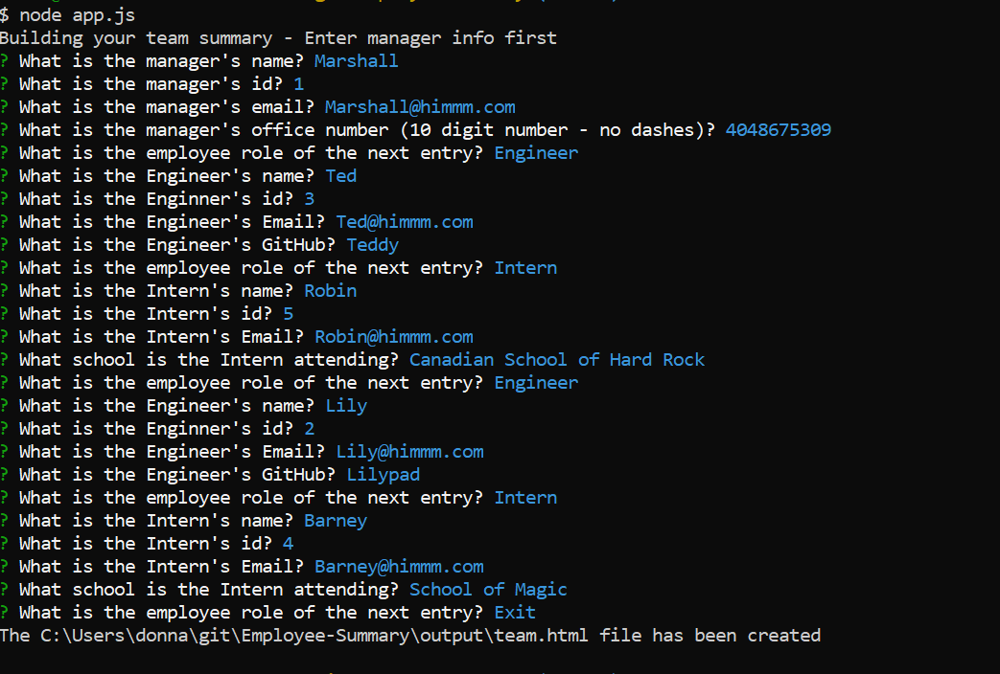
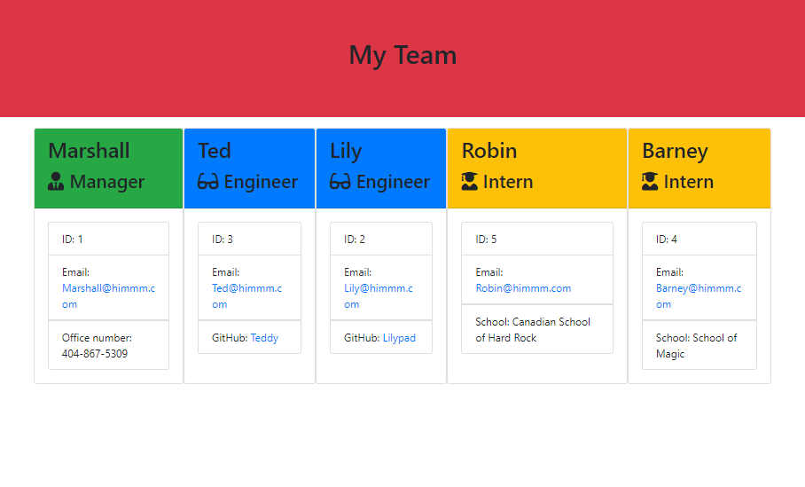
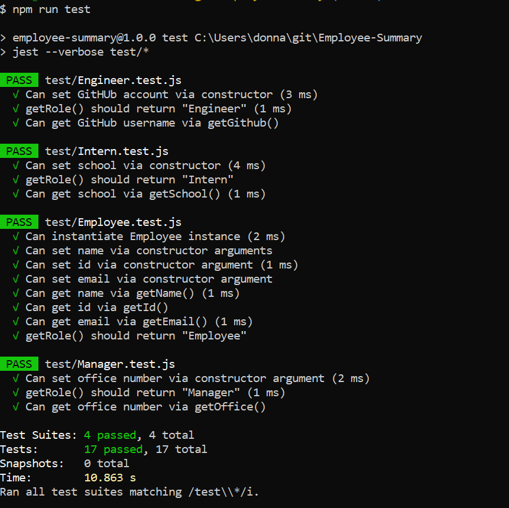

# Employee-Summary

[](https://opensource.org/licenses/MIT)     


## Description

The purpose of this project is to build a Node CLI that takes in information about employees and generates an HTML webpage that displays summaries for each person. Since testing is a key piece in making code maintainable, you will also be ensuring that all unit tests pass.

## Table of Contents
* [Installation](#installation)
* [Usage](#usage)
* [License](#license)
* [Contributing](#contributing)
* [Tests](#tests)
* [Questions](#questions)


## Installation

To install dependencies, run the following:

```
npm i
```
### Built with
* Javascript
* [npm](https://nodejs.org/en/)
* [jest](https://jestjs.io/docs/en/cli)
* [npm inquirer](https://www.npmjs.com/package/inquirer)
* [Visual Studio Code](code.visualstudio.com)

## Usage

node app.js

When the user runs node app.js, the application uses the inquirer package to prompt him/her in the command line with a series of questions about the members of the team.

The application will prompt for the manager information first.  Then the application will prompt for whether the user would like to enter Intern or Engineer information.  Otherwise, the user can choose to exit.  

Roster output
The project must generate a team.html page in the output directory, that displays a nicely formatted team roster. Each team member should display the following in no particular order:
* Name
* Role
* ID
* Role-specific property (School - Intern, link to GitHub profile - Engineer, or office number - Manager)

Each entry is validated.

Finally, the fs.writeFileSync is used to render (using the information entered, main.html, manager.html, engineer.html and intern.html) "team.html" file in the output directory.

### Employee Summary node app.js Image



### Employee Summary Team Html Image



### Employee Summary Team Html Run
[Employee Summary Video Link](https://drive.google.com/file/d/1Si1Zc_tUk_P-ihOjGY-a27yIQTYs0bsd/view?usp=sharing)


## License

This repository is licensed under the MIT License.
[](https://opensource.org/licenses/MIT)


## Contributing

This repository is a homework project and is not accepting contributions.


## Tests

To run tests, run the following:
```
node run test
```
### Employee Summary Test Image



